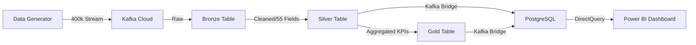

# Technical Architecture & Requirements Definition

## 1. Project Requirements & Objectives
The goal of this system is to provide a resilient, high-velocity UPI ecosystem simulation.
-   **Functional Requirements**: Real-time Kafka streaming (400k records), 55-field Medallion transformation, real-time Fraud Scoring (>0.85), and national Geo-Spatial mapping.
-   **Technical Specifications**: Python 3.14+, Confluent Cloud (Kafka), Databricks (Spark), and PostgreSQL (Local Store).
-   **Core Dependencies**: `confluent-kafka`, `sqlalchemy`, `psycopg2-binary`, `python-dotenv`, `loguru`, and `pyspark`.

---

# Technical Architecture: High-Fidelity UPI Simulation

This project implements a Production-Grade Hybrid Medallion Architecture, designed to handle the complexity of 55+ analytical data dimensions in real-time.

---

## 🏗️ The Data Flow (Medallion Pattern)

---

## 🛠️ Technical Deep Dive

### 1. The Elite Data Model (55+ Fields)
Unlike basic simulators, this project generates a high-fidelity dataset following NPCI standards:
-   **Financials**: Bank RRN, VPA handles, Bank Account masking, and Response Codes (00, ZA, etc.).
-   **Risk & Security**: Real-time **Fraud Scoring** (0.0 - 1.0) and automated Boolean flagging.
-   **Geo-Spatial**: Precise Latitude/Longitude coordinates for 500+ Indian cities.
-   **Hardware Fingerprinting**: Device IDs, OS types (iOS/Android), and App versions.

### 2. Stream Processing (Databricks + Spark)
-   **Resilience**: Using `checkpointLocation` to ensure zero data loss during restarts.
-   **Quality**: Utilizing Spark's `dropDuplicates` to ensure each of the 400,000 transactions is processed exactly once (Idempotency).
-   **Time-Awareness**: Implementing **Watermarking** (10-minute threshold) to handle delayed messages from poor network zones.

### 3. The Analytical Serving Layer (PostgreSQL)
While the cloud handles the heavy lifting, we sync the cleaned data back to a local **PostgreSQL** instance to enable cost-effective, high-speed analytical queries.
-   **Relational Model**: We maintain a structured schema including `upi_transactions`, `upi_merchant_transactions`, and `upi_transaction_gold`.
-   **Idempotent Upserts**: The bridge uses `ON CONFLICT` logic to ensure that our local database stays 100% synchronized with the cloud without record duplication.

### 4. Visualization & Business Intelligence (Power BI)
The final stage is a professional **Power BI Dashboard** that connects to PostgreSQL via DirectQuery.
-   **Real-Time Monitoring**: Live tracking of transaction success vs. failure rates.
-   **Risk Heatmaps**: Visualizing the **Fraud Score** across different merchant categories.
-   **Spatial Mapping**: Using latitude/longitude to map national spending trends across India.

---

## 📈 Strategic Value
This architecture demonstrates:
1.  **Scalability**: Capability to handle hundreds of thousands of messages.
2.  **Integrity**: Strict schema enforcement in a schema-less environment (JSON).
3.  **Visualization**: Real-time mapping and fraud detection dashboards.

---

**Lead Engineer**: Mohamed Sarjun J  
**Email**: sarjunmd1204@gmail.com
